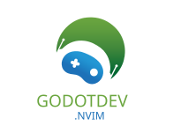
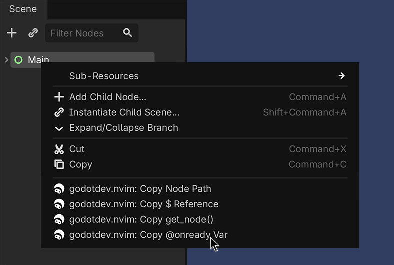
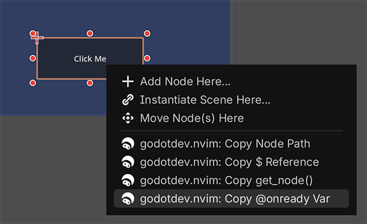
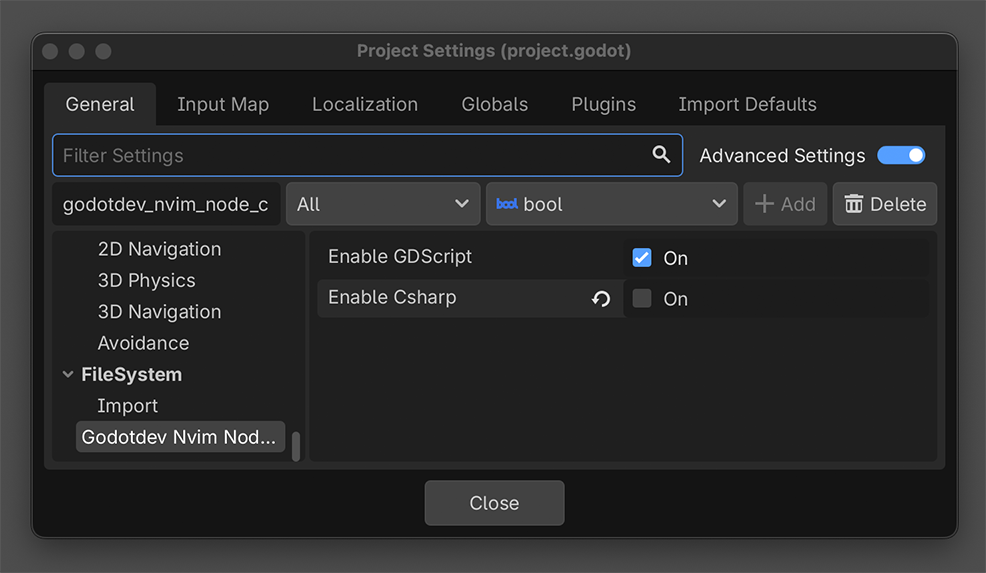

<div align="left">

  [](https://buymeacoffee.com/mathijs.bakker)

</div>
<div align="center"></div>

<div align="center">

[](https://buymeacoffee.com/mathijs.bakker)


</div>

# godotdev.nvim-node-copy

`godotdev.nvim-node-copy` is a small Godot editor addon for users of [`godotdev.nvim`](https://github.com/Mathijs-Bakker/godotdev.nvim).

It adds node-reference actions for the currently selected node and can either copy the generated text to the clipboard or, experimentally, insert it directly at the current cursor position in the active Neovim buffer.

<div align="center">        </div>

## Features

- Copy the selected node path relative to the current scene root
- Copy a `$Node/Child` reference
- Copy a `get_node("Node/Child")` expression
- Copy a typed `@onready var` snippet
- Copy a typed `GetNode<T>()` C# expression
- Copy a C# property snippet
- Works from the current editor selection
- Clipboard workflow for manual paste
- Experimental direct insertion at the current cursor in the active Neovim buffer through Neovim's editor server

## Install

### From AssetLib in the Godot editor

1. Open your project in Godot.
2. Go to the `AssetLib` tab.
3. Search for `godotdev.nvim node copy`.
4. Open the asset page and click `Download`.
5. Keep the install destination as your project root so Godot imports the
   addon into `res://addons/godotdev_nvim_node_copy`.
6. After import, go to `Project > Project Settings > Plugins` and enable
   `godotdev.nvim-node-copy`.

### Manual install

Copy the `addons/godotdev_nvim_node_copy` folder into your Godot project:

```text
res://addons/godotdev_nvim_node_copy
```

Then enable the plugin in:

`Project > Project Settings > Plugins`

## Usage

Select a node in the Scene dock, then use either:

- the Scene Tree right-click menu
- the 2D editor right-click menu
- or the `Project > Tools` menu

Available actions:

- `Project > Tools > godotdev.nvim: Copy Node Path`
- `Project > Tools > godotdev.nvim: Copy $ Reference`
- `Project > Tools > godotdev.nvim: Copy get_node()`
- `Project > Tools > godotdev.nvim: Copy @onready Var`
- `Project > Tools > godotdev.nvim: Copy C# GetNode<T>()`
- `Project > Tools > godotdev.nvim: Copy C# Property`

By default, the generated text is copied to your clipboard. You can also configure the addon to use an experimental insert-at-cursor mode for an already-open Neovim buffer.

## Example Output

For a selected `Player` node:

```gdscript
Player
```

```gdscript
$Player
```

```gdscript
get_node("Player")
```

```gdscript
@onready var player: CharacterBody2D = $Player
```

```csharp
GetNode<CharacterBody2D>("Player")
```

```csharp
private CharacterBody2D Player => GetNode<CharacterBody2D>("Player");
```

## Notes

- The addon uses the selected node relative to the currently edited scene root.
- If the selected node is the scene root itself, the generated snippets use `self` where appropriate.
- The addon supports both GDScript and C# snippet output.

## Configuration

The addon can be configured in Project Settings with:

- `godotdev_nvim_node_copy/enable_gdscript`
- `godotdev_nvim_node_copy/enable_csharp`
- `godotdev_nvim_node_copy/output/mode`
- `godotdev_nvim_node_copy/output/neovim_executable`
- `godotdev_nvim_node_copy/output/neovim_server_address`
- `godotdev_nvim_node_copy/output/fallback_to_clipboard`
- `godotdev_nvim_node_copy/output/focus_after_neovim_remote`
- `godotdev_nvim_node_copy/output/focus_application`

<div align="left"></div>

This controls which language-specific copy actions appear in:
- `Project > Tools`
- the Scene Tree right-click menu
- the 2D editor right-click menu

`Copy Node Path` remains available regardless of language selection.

Output settings:
- `godotdev_nvim_node_copy/output/mode`: `clipboard` or `neovim_remote`
- `godotdev_nvim_node_copy/output/neovim_executable`: the executable used for remote insertion, default `nvim`
- `godotdev_nvim_node_copy/output/neovim_server_address`: the Neovim server address to target, default `/tmp/godot.nvim` on macOS/Linux and `\\.\pipe\godot.nvim` on Windows
- `godotdev_nvim_node_copy/output/fallback_to_clipboard`: if enabled, failed remote insertion falls back to the clipboard
- `godotdev_nvim_node_copy/output/focus_after_neovim_remote`: optionally focus your Neovim application after successful remote insertion
- `godotdev_nvim_node_copy/output/focus_application`: macOS application name to activate after insert, default `Ghostty`

Experimental `neovim_remote` mode inserts text at the current Neovim cursor. It is not drag-and-drop and works best when the target script is already open in Neovim.
It can also optionally focus your Neovim application after a successful insert.

To use experimental direct insertion:
1. Enable the editor server in `godotdev.nvim`, for example with `autostart_editor_server = true`, or start it manually with `:GodotStartEditorServer`.
2. Make sure the server address in Godot matches the Neovim server address configured in `godotdev.nvim`.
3. Set `godotdev_nvim_node_copy/output/mode` to `neovim_remote`.
4. Optional on macOS: enable `godotdev_nvim_node_copy/output/focus_after_neovim_remote` and set `godotdev_nvim_node_copy/output/focus_application` to your terminal app, such as `Ghostty`, `Kitty`, `iTerm`, or `WezTerm`.

This works well when you are inserting multiple nodes into a file that is already open in Neovim. With the current `godotdev.nvim` defaults, `gdscript-formatter --reorder-code` can reorder inserted `@onready` snippets for you on save.

## Icon Import

- Commit the SVG `.import` file for the addon icon so users get consistent editor import settings.
- The icon is intended to use `editor/scale_with_editor_scale=true` for proper HiDPI behavior.
- The current icon import keeps fixed colors with `editor/convert_colors_with_editor_theme=false`.

## Roadmap

- Support `%UniqueNode` when appropriate
- Add C# snippet variants
- Let users choose snippet style in plugin settings
